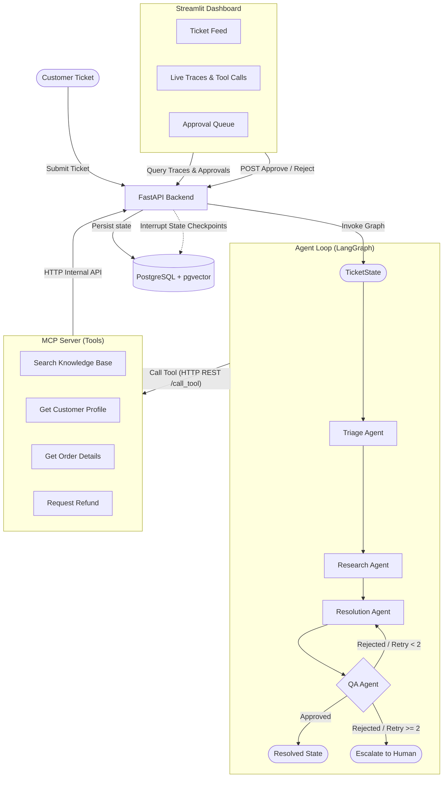

# AI Ops Command Center — Multi-Agent Ecommerce Support System

Welcome to the **AI Ops Command Center**, a customer support ticket processing system. The core design is a collaborative multi-agent relay orchestrated using LangGraph, interacting with a secure MCP (Model Context Protocol) tool server, and audited live on an operational dashboard.

---

## The Workflow in a Nutshell

When a customer support ticket is received:
1. **Triage Agent** classifies the ticket by category and priority.
2. **Research Agent** calls MCP tools to collect customer facts, order history, and policy search hits.
3. **Resolution Agent** drafts a tailored resolution or requests a refund if eligible.
4. **QA Agent** reviews the draft, either approving it or routing it back for revision (escalating to humans after 2 attempts).
5. **Human-in-the-Loop Interruption** pauses execution for operations requiring authorization (e.g. refunds), waiting on human approval before concluding.
6. **Command Center Dashboard** visualizes the traces, tool calls, and approval queues live.

---

## System Architecture

The interaction flow between the components:



---

## Repository Structure

The codebase is organized into isolated, decoupled components:

- **[backend/](file:///Users/harshitchoudhary/Tech2go/Agentic/multi-agent-ecommerce-support/multiagent-ecommerce-support-system/backend/)**: Core FastAPI web service and database schema definitions, including Alembic migrations and database seeding scripts.
- **[mcp_server/](file:///Users/harshitchoudhary/Tech2go/Agentic/multi-agent-ecommerce-support/multiagent-ecommerce-support-system/mcp_server/)**: A FastMCP server exposing database interactions as clean tools for the LLM agents.
- **[agents/](file:///Users/harshitchoudhary/Tech2go/Agentic/multi-agent-ecommerce-support/multiagent-ecommerce-support-system/agents/)**: LangGraph definition orchestrating agent node tasks (Triage, Research, Resolution, QA).
- **dashboard/**: *(Planned - Step 6)* Streamlit user interface visualizing live ticket feeds and handling human-in-the-loop approvals.

---

## Implementation Progress Checklist

This project is currently in the **Halfway Stage (Step 3 completed)**.

- [x] **Step 1: Set up the database**
  - PostgreSQL schema containing `customers`, `orders`, `tickets`, `agent_traces`, `tool_calls`, `refunds`, and `kb_docs` tables.
  - Alembic migration pipeline.
  - Fake data generator (Faker) and Knowledge Base embedding loader (pgvector + Ollama).
- [x] **Step 2: Build the MCP server (the "hands")**
  - FastMCP framework setup.
  - Database lookup tools for customer profiles, order details, and ticket histories.
  - [ ] *Pending*: Knowledge Base semantic search and refund/update/escalate tools.
- [x] **Step 3: Build one agent, end to end**
  - LangGraph environment setup.
  - Triage Agent node using local Ollama model (`llama3.1:8b`) to categorize and prioritize tickets.
  - Automatic database classification patching and execution tracing to `agent_traces`.
  - Verification script running a mock ticket end-to-end.
- [ ] **Step 4: Add the rest of the agent chain**
  - Integrate Research Agent, Resolution Agent, and QA Agent nodes.
  - Enforce QA reject retry threshold (escalate to human after 2 tries).
- [ ] **Step 5: Add the human approval step**
  - Implement LangGraph interruption checkpoints.
  - Expose API endpoints for human approval/rejection.
- [ ] **Step 6: Build the dashboard**
  - Streamlit application displaying live ticket feeds, detail traces, and approval controls.
- [ ] **Step 7: Polish it for your portfolio**
  - System performance and security adjustments.

---

## Getting Started

You can run the entire stack (Database, Backend API, and MCP Server) together in a single command using Docker Compose, or run components individually for development.

### Method 1: Running with Docker Compose (Recommended)

1. Ensure **Ollama** is running locally on your host machine with the required models:
   ```bash
   ollama pull llama3.1:8b
   ollama pull nomic-embed-text
   ```

2. Spin up the entire stack from the root directory:
   ```bash
   docker compose up --build
   ```
   *This automatically builds the backend and MCP server containers, launches a PostgreSQL container with `pgvector`, executes database migrations (`alembic upgrade head`), and exposes the services:*
   - **Backend API**: `http://localhost:8000`
   - **MCP Server (SSE)**: `http://localhost:8001`

3. Seed the database (runs on host machine; requires backend virtual environment dependencies installed):
   ```bash
   cd backend
   source venv/bin/activate
   python -m seed.generate_data
   python -m seed.generate_embeddings
   ```

---

### Method 2: Manual Local Setup (Individual Components)

If you are modifying code and want hot-reloading for local development, refer to individual README guides:

1. Setup the Database and REST API: **[Backend README](file:///Users/harshitchoudhary/Tech2go/Agentic/multi-agent-ecommerce-support/multiagent-ecommerce-support-system/backend/README.md)**
2. Setup and run the MCP tools layer: **[MCP Server README](file:///Users/harshitchoudhary/Tech2go/Agentic/multi-agent-ecommerce-support/multiagent-ecommerce-support-system/mcp_server/README.md)**
3. Setup and run the LangGraph workspace: **[Agents README](file:///Users/harshitchoudhary/Tech2go/Agentic/multi-agent-ecommerce-support/multiagent-ecommerce-support-system/agents/README.md)**

---

## Observability & Logging Dashboard

We run a containerized observability stack consisting of **Grafana Loki** (log aggregator), **Promtail** (log shipper), and **Grafana** (dashboard UI) alongside the application containers.

To view the logs from all major execution steps:

1. Open **Grafana** in your browser: **[http://localhost:3000](http://localhost:3000)**
2. Log in using default credentials:
   - **Username**: `admin`
   - **Password**: `admin`
   - *If prompted to change your password on first login, click the "Skip" button.*
3. Navigate to the **Explore** page by clicking the compass icon in the left-hand sidebar (or go directly to **[http://localhost:3000/explore](http://localhost:3000/explore)**).
4. Ensure **Loki** is selected in the data source dropdown at the top-left.
5. In the query text box (Code tab) or label browser, query the logs using:
   ```text
   {job="support-logs"}
   ```
6. Set the **Time Range Picker** (clock icon in the top-right, next to the run button) to **Last 1 hour** or **Last 3 hours** to make sure it includes the time you executed the ticket tests.
7. Click the blue **Run query** button in the top-right to display the logs.