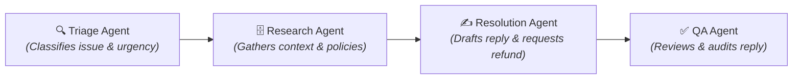
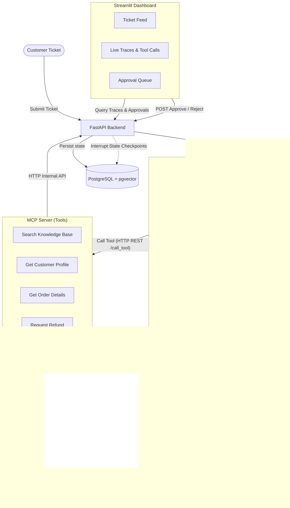

# AI Ops Command Center — Multi-Agent Ecommerce Support System

Welcome to the **AI Ops Command Center**, a customer support ticket processing system. The core design is a collaborative multi-agent relay orchestrated using LangGraph, interacting with a secure MCP (Model Context Protocol) tool server, and audited live on an operational dashboard.

---

## How It Works

Imagine a customer support team where instead of one person handling everything, you have a **relay team of specialized AI agents** passing a ticket along, step-by-step. Each agent is a specialist focused on doing one job perfectly:



### Meet the AI Agents:

1. 🔍 **The Triage Agent (The Gatekeeper)**
   Looks at the incoming ticket, classifies it (e.g., as a refund request, bug report, or complaint), and determines how urgently it needs to be handled.
   * **Under the hood**: It parses raw ticket text using a local LLM (`llama3.1:8b`), outputs a structured category and priority, and patches the database classification via the MCP server.

2. 🗄️ **The Research Agent (The Fact-Finder)**
   Searches the company's internal knowledge base for relevant policy articles (like returns or shipping FAQs), looks up the customer's profile, and fetches their purchase history.
   * **Under the hood**: It generates text embeddings using `nomic-embed-text` and performs a pgvector similarity search on knowledge base documents, querying customer SQL records through MCP lookup tools.

3. ✍️ **The Resolution Agent (The Writer)**
   Takes the customer history and relevant policies gathered by the Research Agent to write a personalized, empathetic draft reply. If the policies show the request is eligible for a refund, it submits a request.
   * **Under the hood**: Prompts the LLM with customer data and policy context to produce a JSON response. If eligible, it calls the `create_refund_request` MCP tool to queue a database refund.

4. ✅ **The QA Agent (The Auditor)**
   Reviews the draft reply to ensure it is polite, clear, does not contradict policies, and does not make unauthorized promises. If not approved, it sends it back to the Resolution Agent with feedback (escalating to humans after 2 attempts).
   * **Under the hood**: Prompts the LLM with the ticket, context, and draft response, parses its JSON score, updates the iteration counters, and logs the review trace via the MCP server.

5. 🛡️ **Human-in-the-Loop Safeguard (The Manager)**
   The AI is never allowed to issue refunds or send money on its own. If a refund is requested, the system pauses the workflow and alerts a human manager. The action is only completed after a human reviews and clicks "Approve".
   * **Under the hood**: Uses LangGraph's state persistence (`interrupt` capability) to pause graph execution and save the state to PostgreSQL, exposing a REST API endpoint for human approval.

## System Architecture

The interaction flow between the components:



---

## Repository Structure

The codebase is organized into isolated, decoupled components:

- **[backend/](file:///Users/harshitchoudhary/Tech2go/Agentic/multi-agent-ecommerce-support/multiagent-ecommerce-support-system/backend/)**: Core FastAPI web service and database schema definitions, including Alembic migrations and database seeding scripts.
- **[mcp_server/](file:///Users/harshitchoudhary/Tech2go/Agentic/multi-agent-ecommerce-support/multiagent-ecommerce-support-system/mcp_server/)**: A FastMCP server exposing database interactions as clean tools for the LLM agents.
- **[agents/](file:///Users/harshitchoudhary/Tech2go/Agentic/multi-agent-ecommerce-support/multiagent-ecommerce-support-system/agents/)**: LangGraph definition orchestrating agent node tasks (Triage, Research, Resolution, QA).
- **dashboard/**: *(Planned - Step 6)* Streamlit user interface visualizing live ticket feeds and handling human-in-the-loop approvals.


---

## Getting Started

You can run the entire stack (Database, Backend API, and MCP Server) together in a single command using Docker Compose, or run components individually for development.

### Method 1: Running with Docker Compose (Recommended)

1. Ensure **Ollama** is running locally on your host machine with the required models:
   ```bash
   ollama pull llama3.1:8b
   ollama pull nomic-embed-text
   ```

2. Spin up the entire stack from the root directory:
   ```bash
   docker compose up --build
   ```
   *This automatically builds the backend and MCP server containers, launches a PostgreSQL container with `pgvector`, executes database migrations (`alembic upgrade head`), and exposes the services:*
   - **Backend API**: `http://localhost:8000`
   - **MCP Server (SSE)**: `http://localhost:8001`

3. Seed the database (runs on host machine; requires backend virtual environment dependencies installed):
   ```bash
   cd backend
   source venv/bin/activate
   python -m seed.generate_data
   python -m seed.generate_embeddings
   ```

---

### Method 2: Manual Local Setup (Individual Components)

If you are modifying code and want hot-reloading for local development, refer to individual README guides:

1. Setup the Database and REST API: **[Backend README](file:///Users/harshitchoudhary/Tech2go/Agentic/multi-agent-ecommerce-support/multiagent-ecommerce-support-system/backend/README.md)**
2. Setup and run the MCP tools layer: **[MCP Server README](file:///Users/harshitchoudhary/Tech2go/Agentic/multi-agent-ecommerce-support/multiagent-ecommerce-support-system/mcp_server/README.md)**
3. Setup and run the LangGraph workspace: **[Agents README](file:///Users/harshitchoudhary/Tech2go/Agentic/multi-agent-ecommerce-support/multiagent-ecommerce-support-system/agents/README.md)**

---

## Observability & Logging Dashboard

We run a containerized observability stack consisting of **Grafana Loki** (log aggregator), **Promtail** (log shipper), and **Grafana** (dashboard UI) alongside the application containers.

To view the logs from all major execution steps:

1. Open **Grafana** in your browser: **[http://localhost:3000](http://localhost:3000)**
2. Log in using default credentials:
   - **Username**: `admin`
   - **Password**: `admin`
   - *If prompted to change your password on first login, click the "Skip" button.*
3. Navigate to the **Explore** page by clicking the compass icon in the left-hand sidebar (or go directly to **[http://localhost:3000/explore](http://localhost:3000/explore)**).
4. Ensure **Loki** is selected in the data source dropdown at the top-left.
5. In the query text box (Code tab) or label browser, query the logs using:
   ```text
   {job="support-logs"}
   ```
6. Set the **Time Range Picker** (clock icon in the top-right, next to the run button) to **Last 1 hour** or **Last 3 hours** to make sure it includes the time you executed the ticket tests.
7. Click the blue **Run query** button in the top-right to display the logs.