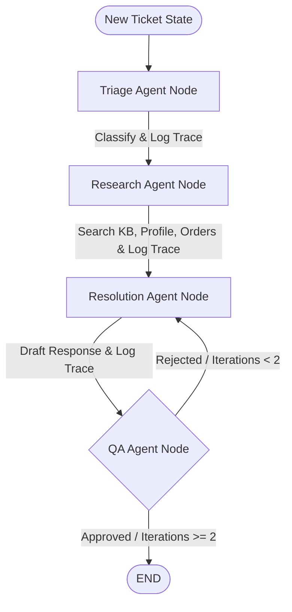

# Agents — LangGraph Support Agent Orchestration

This is the orchestration and reasoning layer of the Ecommerce Support System. It utilizes [LangGraph](https://github.com/langchain-ai/langgraph) to coordinate multiple specialized AI agents in a collaborative graph workflow. Each agent operates as a graph node, parsing inputs, executing tools, making decisions, and modifying the global ticket state.

---

## Orchestration Architecture

The agent graph links multiple nodes. Currently, **Triage** and **Research** nodes are fully wired:



---

## Graph State Schema (`TicketState`)

The graph operations rely on a central state dictionary passed between nodes. Defined in [state.py](file:///Users/harshitchoudhary/Tech2go/Agentic/multi-agent-ecommerce-support/multiagent-ecommerce-support-system/agents/app/graph/state.py):

| State Attribute | Type | Description |
|---|---|---|
| `ticket_id` | `str` | The unique ID of the support ticket in the database |
| `customer_id` | `str` | The unique ID of the customer who submitted the ticket |
| `order_id` | `Optional[str]` | The relevant order ID, if linked to the ticket |
| `subject` | `Optional[str]` | The subject line of the support ticket |
| `body` | `str` | The body text/message of the ticket |
| `category` | `Optional[str]` | Classification category (billing, bug, refund, etc.) |
| `priority` | `Optional[str]` | Priority/urgency level (low, medium, high, urgent) |
| `kb_results` | `list` | Matching knowledge base search results (loaded by Research node) |
| `draft_response` | `Optional[str]` | Draft answer compiled by Resolution Agent (Step 4+) |
| `qa_approved` | `bool` | Evaluation flag set by QA Agent (Step 4+) |
| `iteration_count` | `int` | Counter tracking loops between QA and Resolution nodes (Step 4+) |
| `requires_human_approval` | `bool` | Flag that pauses the graph for human intervention (Step 5+) |

---

## Agent Node Details

### 1. Triage Agent Node
- **File**: [triage.py](file:///Users/harshitchoudhary/Tech2go/Agentic/multi-agent-ecommerce-support/multiagent-ecommerce-support-system/agents/app/graph/nodes/triage.py)
- **Role**: Reads the support ticket, determines the issue type, and labels its priority.
- **Model**: Local Ollama execution (configured model e.g., `llama3.1:8b`).
- **Allowed Categories**: `billing`, `bug`, `how_to`, `refund`, `complaint`, `other`
- **Allowed Priorities**: `low`, `medium`, `high`, `urgent`
- **Actions (via MCP server)**:
  1. Prompts LLM to output a JSON object: `{"category": "...", "priority": "..."}`.
  2. Updates state with classification labels.
  3. Calls `classify_ticket` tool on MCP server.
  4. Calls `create_trace` tool on MCP server to log a step 1 trace audit.

### 2. Research Agent Node
- **File**: [research.py](file:///Users/harshitchoudhary/Tech2go/Agentic/multi-agent-ecommerce-support/multiagent-ecommerce-support-system/agents/app/graph/nodes/research.py)
- **Role**: Gathers customer and context details.
- **Actions (via MCP server)**:
  1. Queries customer metadata using `get_customer_profile` tool.
  2. Queries order history using `get_customer_order_history` tool.
  3. Queries past tickets using `get_past_tickets` tool.
  4. Performs pgvector semantic similarity search on knowledge base docs using `search_knowledge_base` tool.
  5. Queries specific order details (if linked) using `get_order_details` tool.
  6. Calls `create_trace` tool to log a step 2 trace audit.

### 3. Resolution Agent Node
- **File**: [resolution.py](file:///Users/harshitchoudhary/Tech2go/Agentic/multi-agent-ecommerce-support/multiagent-ecommerce-support-system/agents/app/graph/nodes/resolution.py)
- **Role**: Synthesizes facts to draft customer replies and handles refund requests.
- **Actions (via MCP server)**:
  1. Drafts an empathetic response using customer context and knowledge articles.
  2. If policies allow a refund, calls the `create_refund_request` tool to queue a refund request in PostgreSQL.
  3. Calls `create_trace` tool to log a step 3 trace audit.

### 4. QA Agent Node
- **File**: [qa.py](file:///Users/harshitchoudhary/Tech2go/Agentic/multi-agent-ecommerce-support/multiagent-ecommerce-support-system/agents/app/graph/nodes/qa.py)
- **Role**: Audits draft replies for compliance, clarity, tone, and policy alignment.
- **Actions (via MCP server)**:
  1. Reviews the drafted reply against original ticket and knowledge base context.
  2. Decides to approve or reject the draft (providing feedback if rejected).
  3. Updates iteration counts and routes the graph (resolves to Resolution for up to 2 retries, otherwise escalates).
  4. Calls `create_trace` tool to log a step 4 trace audit.

---

## Setup & Running Instructions

### 1. Installation

Create a virtual environment inside the `agents/` directory, activate it, and install dependencies:

```bash
python3 -m venv venv
source venv/bin/activate
pip install -r requirements.txt
```

### 2. Configuration

Copy the example configuration file:

```bash
cp .env.example .env
```

Variables configured in `.env`:
- `BACKEND_BASE_URL`: API backend endpoint (default: `http://localhost:8000`).
- `MCP_SERVER_URL`: HTTP Gateway endpoint for the MCP server (default: `http://localhost:8001`).
- `OLLAMA_MODEL`: LLM run by local Ollama instance (default: `llama3.1:8b`).

### 3. Running & Testing

Ensure that the backend FastAPI service, the MCP server, and the Ollama server are all active before executing agent scripts.

To run a test ticket through the triage and research node workflow:

```bash
python -m app.test_ticket
```

This runs the script defined in [test_ticket.py](file:///Users/harshitchoudhary/Tech2go/Agentic/multi-agent-ecommerce-support/multiagent-ecommerce-support-system/agents/app/test_ticket.py), which:
1. Fetches a customer from the database.
2. Creates a support ticket for them.
3. Invokes the `compiled_graph` using the ticket's state.
4. Outputs the final state after Triage classification and Research tools have finished.
