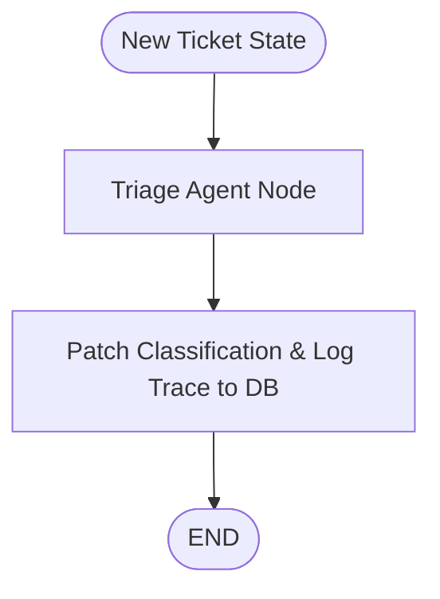

# Agents — LangGraph Support Agent Orchestration

This is the orchestration and reasoning layer of the Ecommerce Support System. It utilizes [LangGraph](https://github.com/langchain-ai/langgraph) to coordinate multiple specialized AI agents in a collaborative graph workflow. Each agent operates as a graph node, parsing inputs, executing tools, making decisions, and modifying the global ticket state.

## Current Orchestration Architecture

Currently, the orchestration is in a **half-implemented state (Step 3)**:
- **Completed**: Triage Agent node, graph compilation, and FastAPI trace/classification integration.
- **Pending**: Research Agent, Resolution Agent, QA Agent, and Human-in-the-Loop approval interception.



---

## Graph State Schema (`TicketState`)

The graph operations rely on a central state dictionary passed between nodes. Defined in [state.py](file:///Users/harshitchoudhary/Tech2go/Agentic/multi-agent-ecommerce-support/multiagent-ecommerce-support-system/agents/app/graph/state.py):

| State Attribute | Type | Description |
|---|---|---|
| `ticket_id` | `str` | The unique ID of the support ticket in the database |
| `customer_id` | `str` | The unique ID of the customer who submitted the ticket |
| `order_id` | `Optional[str]` | The relevant order ID, if linked to the ticket |
| `subject` | `Optional[str]` | The subject line of the support ticket |
| `body` | `str` | The body text/message of the ticket |
| `category` | `Optional[str]` | Classification category (billing, bug, refund, etc.) |
| `priority` | `Optional[str]` | Priority/urgency level (low, medium, high, urgent) |
| `kb_results` | `list` | Matching knowledge base search results (Step 4+) |
| `draft_response` | `Optional[str]` | Draft answer compiled by Resolution Agent (Step 4+) |
| `qa_approved` | `bool` | Evaluation flag set by QA Agent (Step 4+) |
| `iteration_count` | `int` | Counter tracking loops between QA and Resolution nodes (Step 4+) |
| `requires_human_approval` | `bool` | Flag that pauses the graph for human intervention (Step 5+) |

---

## Agent Node Details

### 1. Triage Agent (Active)
- **File**: [triage.py](file:///Users/harshitchoudhary/Tech2go/Agentic/multi-agent-ecommerce-support/multiagent-ecommerce-support-system/agents/app/graph/nodes/triage.py)
- **Role**: Reads the support ticket, determines the issue type, and labels its priority.
- **Model**: Local Ollama execution (configured model e.g., `llama3.1:8b`).
- **Allowed Categories**: `billing`, `bug`, `how_to`, `refund`, `complaint`, `other`
- **Allowed Priorities**: `low`, `medium`, `high`, `urgent`
- **Actions**:
  1. Prompts LLM to output a JSON object: `{"category": "...", "priority": "..."}`.
  2. Updates state with classification labels.
  3. Sends `PATCH /internal/tickets/{ticket_id}/classification` to the backend.
  4. Records a step trace by posting to `/internal/traces` in the backend.

### 2. Future Agents (Planned)
- **Research Agent**: Query customer, order, and knowledge base details using MCP tools.
- **Resolution Agent**: Synthesize data to draft customer replies; request refunds.
- **QA Agent**: Audit replies for accuracy and compliance; route ticket back to Resolution or escalate if loops exceed 2 retries.

---

## Setup & Running Instructions

### 1. Installation

Create a virtual environment inside the `agents/` directory, activate it, and install dependencies:

```bash
python3 -m venv venv
source venv/bin/activate
pip install -r requirements.txt
```

### 2. Configuration

Copy the example configuration file:

```bash
cp .env.example .env
```

Variables configured in `.env`:
- `BACKEND_BASE_URL`: API backend endpoint (default: `http://localhost:8000`).
- `OLLAMA_MODEL`: LLM run by local Ollama instance (default: `llama3.1:8b`).

### 3. Running & Testing

Ensure that both the backend FastAPI service and the Ollama server are active before executing agent scripts.

To run a test ticket through the triage node workflow:

```bash
python -m app.test_ticket
```

This runs the script defined in [test_ticket.py](file:///Users/harshitchoudhary/Tech2go/Agentic/multi-agent-ecommerce-support/multiagent-ecommerce-support-system/agents/app/test_ticket.py), which:
1. Fetches a customer from the database.
2. Creates a support ticket for them.
3. Invokes the `compiled_graph` using the ticket's state.
4. Outputs the final state after classification.

To run the graph on a specific existing ticket ID:

```bash
python -m app.main <ticket_id>
```
