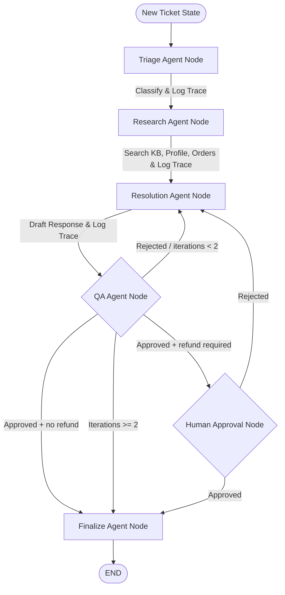

# Agents — LangGraph Support Agent Orchestration

This is the orchestration and reasoning layer of the Ecommerce Support System. It uses [LangGraph](https://github.com/langchain-ai/langgraph) to coordinate multiple specialized AI agents in a collaborative graph workflow. Each agent operates as a graph node, parsing inputs, executing tools, making decisions, and modifying the global ticket state.

The agent service exposes a FastAPI server (port `8002`) that accepts ticket run and resume requests from external callers (e.g., `test_ticket.py` or a future dashboard).

---

## Orchestration Architecture

The full 6-node agent graph:



### Routing Logic

| From | Condition | To |
|---|---|---|
| QA | `qa_approved=True` AND `requires_human_approval=True` | Human Approval |
| QA | `qa_approved=True` AND `requires_human_approval=False` | Finalize |
| QA | `qa_approved=False` AND `iteration_count < 2` | Resolution |
| QA | `qa_approved=False` AND `iteration_count >= 2` | Finalize |
| Human Approval | `qa_approved=True` | Finalize |
| Human Approval | `qa_approved=False` | Resolution |

---

## Graph State Schema (`TicketState`)

The graph operations rely on a central state dictionary passed between nodes. Defined in [state.py](file:///Users/harshitchoudhary/Tech2go/Agentic/multi-agent-ecommerce-support/multiagent-ecommerce-support-system/agents/app/graph/state.py):

| State Attribute | Type | Description |
|---|---|---|
| `ticket_id` | `str` | The unique ID of the support ticket in the database |
| `customer_id` | `str` | The unique ID of the customer who submitted the ticket |
| `order_id` | `Optional[str]` | The relevant order ID, if linked to the ticket |
| `subject` | `Optional[str]` | The subject line of the support ticket |
| `body` | `str` | The body text/message of the ticket |
| `category` | `Optional[str]` | Classification category (billing, bug, refund, etc.) |
| `priority` | `Optional[str]` | Priority/urgency level (low, medium, high, urgent) |
| `kb_results` | `list` | Matching knowledge base search results (loaded by Research node) |
| `draft_response` | `Optional[str]` | Draft answer compiled by Resolution Agent |
| `qa_feedback` | `Optional[str]` | Feedback from QA Agent when draft is rejected |
| `qa_approved` | `bool` | Evaluation flag set by QA Agent |
| `iteration_count` | `int` | Counter tracking loops between QA and Resolution nodes |
| `requires_human_approval` | `bool` | Flag set by Resolution Agent when a refund is requested |

---

## Agent Node Details

### 1. Triage Agent Node
- **File**: [triage.py](file:///Users/harshitchoudhary/Tech2go/Agentic/multi-agent-ecommerce-support/multiagent-ecommerce-support-system/agents/app/graph/nodes/triage.py)
- **Role**: Reads the support ticket, determines the issue type, and labels its priority.
- **Model**: Local Ollama execution (configured model e.g., `llama3.1:8b`).
- **Allowed Categories**: `billing`, `bug`, `how_to`, `refund`, `complaint`, `other`
- **Allowed Priorities**: `low`, `medium`, `high`, `urgent`
- **Actions (via MCP server)**:
  1. Prompts LLM to output a JSON object: `{"category": "...", "priority": "..."}`.
  2. Updates state with classification labels.
  3. Calls `classify_ticket` tool on MCP server.
  4. Calls `create_trace` tool to log a step 1 trace audit.

### 2. Research Agent Node
- **File**: [research.py](file:///Users/harshitchoudhary/Tech2go/Agentic/multi-agent-ecommerce-support/multiagent-ecommerce-support-system/agents/app/graph/nodes/research.py)
- **Role**: Gathers customer and context details.
- **Actions (via MCP server)**:
  1. Queries customer metadata using `get_customer_profile` tool.
  2. Queries order history using `get_customer_order_history` tool.
  3. Queries past tickets using `get_past_tickets` tool.
  4. Performs pgvector semantic similarity search on knowledge base docs using `search_knowledge_base` tool.
  5. Queries specific order details (if linked) using `get_order_details` tool.
  6. Calls `create_trace` tool to log a step 2 trace audit.

### 3. Resolution Agent Node
- **File**: [resolution.py](file:///Users/harshitchoudhary/Tech2go/Agentic/multi-agent-ecommerce-support/multiagent-ecommerce-support-system/agents/app/graph/nodes/resolution.py)
- **Role**: Synthesizes facts to draft customer replies and handles refund requests.
- **Actions (via MCP server)**:
  1. Drafts an empathetic response using customer context and knowledge articles.
  2. If policies allow a refund, calls `create_refund_request` tool to queue a refund in PostgreSQL and sets `requires_human_approval=True` in state.
  3. Calls `create_trace` tool to log a step 3 trace audit.

### 4. QA Agent Node
- **File**: [qa.py](file:///Users/harshitchoudhary/Tech2go/Agentic/multi-agent-ecommerce-support/multiagent-ecommerce-support-system/agents/app/graph/nodes/qa.py)
- **Role**: Audits draft replies for compliance, clarity, tone, and policy alignment.
- **Actions (via MCP server)**:
  1. Reviews the drafted reply against original ticket and knowledge base context.
  2. Decides to approve or reject the draft (providing feedback if rejected).
  3. Updates iteration counts and routes the graph (retries Resolution up to 2 times, otherwise proceeds).
  4. Calls `create_trace` tool to log a step 4 trace audit.

### 5. Human Approval Node *(new)*
- **File**: [human_approval.py](file:///Users/harshitchoudhary/Tech2go/Agentic/multi-agent-ecommerce-support/multiagent-ecommerce-support-system/agents/app/graph/nodes/human_approval.py)
- **Role**: Acts as a mandatory checkpoint for any ticket that triggered a refund request. The AI never issues refunds autonomously — a human manager must review and decide.
- **Two operating modes**:

  | Mode | How to enable | Behaviour |
  |---|---|---|
  | **MVP (default)** | `MVP_AUTO_APPROVE = True` in `human_approval.py` | Auto-approves; graph runs to END in one `ainvoke()` call |
  | **Production** | `MVP_AUTO_APPROVE = False` + `interrupt_before=["human_approval"]` in `graph.py` | Graph pauses; resumes only after human decision via `/resume` API |

- **State changes**:
  - On approval: sets `qa_approved=True`, `requires_human_approval=False`
  - On rejection: sets `qa_approved=False`, `qa_feedback=<reason>`, `requires_human_approval=False` → routes back to Resolution

### 6. Finalize Agent Node
- **File**: [finalize.py](file:///Users/harshitchoudhary/Tech2go/Agentic/multi-agent-ecommerce-support/multiagent-ecommerce-support-system/agents/app/graph/nodes/finalize.py)
- **Role**: Commits the resolved ticket to the database — saves the agent's reply as a ticket message, marks the ticket status as `resolved`, and logs the final audit trace.
- **Actions (via MCP server)**:
  1. Calls `create_ticket_message` to persist the approved draft response.
  2. Calls `update_ticket_status` to mark the ticket as `resolved`.
  3. Calls `create_trace` to log a step 5 finalize audit trace.

---

## Agents Service API

The agents service (`app/main.py`) is a FastAPI application running on port `8002`.

| Endpoint | Method | Description |
|---|---|---|
| `/tickets/{ticket_id}/run` | `POST` | Kicks off the full agent graph for a ticket |
| `/tickets/{ticket_id}/resume` | `POST` | Resumes a paused graph after human decision (production mode) |
| `/health` | `GET` | Health check |

### `/run` response shapes

```json
// Graph completed successfully
{"status": "completed", "result": { ...TicketState... }}

// Graph paused at human_approval (production mode only)
{"status": "paused", "interrupt": ["refund requested - needs human approval"]}

// Graph encountered an error
{"error": "RuntimeError", "detail": "...", "ticket_id": "..."}
```

### `/resume` request body

```json
// Approve the refund
{"approved": true}

// Reject with a reason (routes back to Resolution Agent)
{"approved": false, "note": "Order is outside the 30-day return window"}
```

---

## Setup & Running Instructions

### 1. Installation

Create a virtual environment inside the `agents/` directory, activate it, and install dependencies:

```bash
python3 -m venv venv
source venv/bin/activate
pip install -r requirements.txt
```

### 2. Configuration

Copy the example configuration file:

```bash
cp .env.example .env
```

Variables configured in `.env`:
- `BACKEND_BASE_URL`: API backend endpoint (default: `http://localhost:8000`).
- `MCP_SERVER_URL`: HTTP Gateway endpoint for the MCP server (default: `http://localhost:8001`).
- `OLLAMA_MODEL`: LLM run by local Ollama instance (default: `llama3.1:8b`).
- `DATABASE_URL`: PostgreSQL connection string used for LangGraph checkpointing.

### 3. Running the Agents Service

Ensure the backend FastAPI service, the MCP server, and the Ollama server are all running first.

```bash
uvicorn app.main:app --port 8002
```

### 4. Running the End-to-End Test

```bash
python -m app.test_ticket
```

This script ([test_ticket.py](file:///Users/harshitchoudhary/Tech2go/Agentic/multi-agent-ecommerce-support/multiagent-ecommerce-support-system/agents/app/test_ticket.py)):
1. Fetches a sample customer with orders from the backend.
2. Creates a support ticket for them (subject: *"Refund for damaged item"*).
3. POSTs to `/tickets/{id}/run` to invoke the full agent graph.
4. If the graph pauses at `human_approval`, simulates a manager approval via `/tickets/{id}/resume`.
5. Logs the final resolved ticket state.

---

## Enabling Real Human-in-the-Loop (Production Mode)

By default, the human approval step is **auto-approved** so the graph runs to completion in one shot (ideal for MVP/local development). To switch to real human-in-the-loop:

**Step 1** — In `human_approval.py`, change:
```python
MVP_AUTO_APPROVE = True   # change to False
```

**Step 2** — In `graph.py`, change the compile call:
```python
# from:
return graph.compile(checkpointer=checkpointer)

# to:
return graph.compile(checkpointer=checkpointer, interrupt_before=["human_approval"])
```

The graph will now pause after QA approval and return `{"status": "paused"}` from the `/run` endpoint. Send the human decision to resume:

```bash
curl -X POST http://localhost:8002/tickets/{ticket_id}/resume \
  -H "Content-Type: application/json" \
  -d '{"approved": true}'
```
